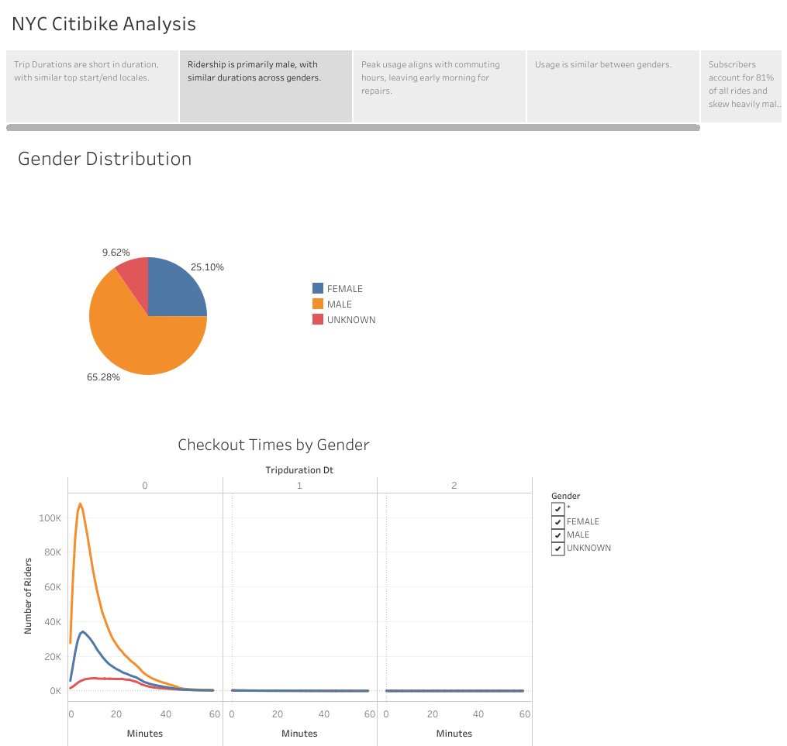

# bikesharing
## Overview of the Analysis
The objective of this challenge is to utilize Tableau Public to present robust and customized data visualizations to present data from a massive .csv file containing the anonymized records of thousands of individual bike trips that utilized the NYC Citibike network. The results from this analysis will be used to investigate the viability of developing a similar bikeshare network in Des Moines, Iowa (go Hawkeyes).

## Results
### Link to Analysis on Tableau Public
[NYC Citibike Analysis](https://public.tableau.com/app/profile/chris.bly/viz/NYC_Citibike_Analysis_16412605696360/NYCCitibikeAnalysis)

### Description of the Analyses
#### Trip Durations and Top Locations 
 
- The peak duration of use is very short, only 5-6 minutes. This indicates that many Citibikes are used as a "last mile" to connect users from other forms of public transit to their final destinations.
- The vast majority of the top starting and ending locations are in Manhattan, which makes sense because this is where the highest concentration of commuting jobs exist in New York.

#### Gender Distribution
 
- Ridership is over 65% male.
- While most riders are male, the peak duration of bike use is similar between all genders.

#### Peak Usage and Repair Window
 
- Peak usage aligns with commute times where workers are going to and returning from work. We see the weekends skew towards heavier mid-day use which would align with leisure activities (brunch maybe?) and increased tourist traffic.
- Wednesday evenings are markedly less trafficed than other weeknights. Happy hours, perhaps?
- The graph of peak hours in August, a heavy use month with optimal weather, shows that 1am-4am comprise the lightest usage. This is an optimal time to perform rebalancing of stations and any maintenance necessary on the bikes in the network.

#### Gender Heatmaps
 
- While we know that males make up a majority of users, we see similar trends in usage throughout the day between males and females. The unkown gender group is of a size where it is difficult to draw any conclusions.

#### Subscibers vs. Single Users
 
- Subscribers comprise 81% of all rides, indicating that the bikeshare's success is heavily driven by regular users who most likely use the bikes to commute to and from work in addition to, or in place of, other public transit options.
- Similar to the other graphs, we see a heavy skew towards males in the subscribers and customers, with consistent patterns of usage independent of gender.

## Conclusions
In conclusion, we can see that there is a high volume of bikeshare usage in New York City, particularly in the summer months. The bike usage and subscriptions skewed heavily male, and based on the peak usage times of day it appears that commuters make up a majority of riders. Because the peak duration of rides was relatively low, it can also be assumed that the bikes are being used as a final portion of their daily commute as opposed to a complete replacement for other public transit options. 

Further visualizations that could be added to this presentation to help inform the viability of a bikeshare program in Des Moines would include:
- A comparison of total rides per month that would present useful information to adapting a bikeshare system to a city with harsher winter months with the potential for increased snowfall and wind events.
- A comparison of top usage station maps for subscribers vs. non-subscribed users to determine the use by tourists who would likely not plunk down the change for a full subscription to use the bikes for an isolated amount of time. This would help demonstrate the importance of locating potential Des Moines stations near heavy business areas vs. more touristy options.
